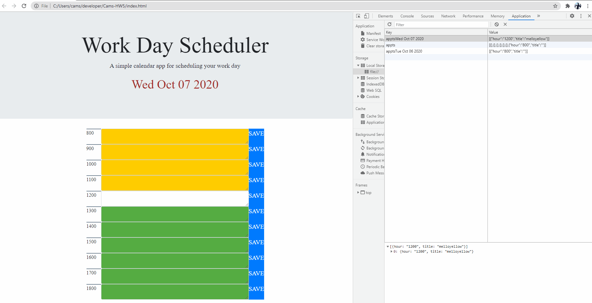

# Cams-HW5
Daily planner

# Overview
# Installation
# license

## Overview

============================================

I was tasked with creating a Workday scheduler.
I did this by using boostraps input forms.
I dynamically created each row for each hour. 

GIVEN I am using a daily planner to create a schedule
WHEN I open the planner
THEN the current day is displayed at the top of the calendar
WHEN I scroll down
THEN I am presented with time blocks for standard business hours
WHEN I view the time blocks for that day
THEN each time block is color-coded to indicate whether it is in the past, present, or future
WHEN I click into a time block
THEN I can enter an event
WHEN I click the save button for that time block
THEN the text for that event is saved in local storage
WHEN I refresh the page
THEN the saved events persist

## Installation

============================================

Github link: https://github.com/Chickey49/Cams-HW5

Deployed link: https://chickey49.github.io/Cams-HW5/

## License

============================================
Open source.